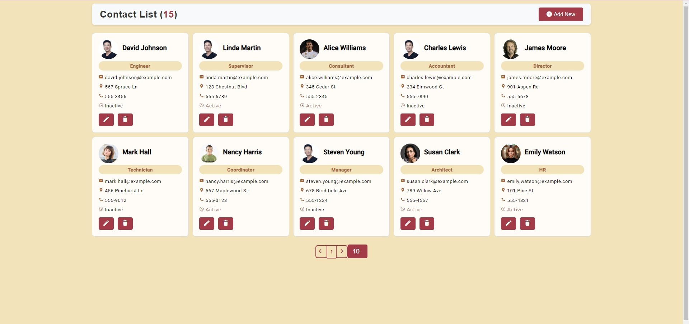
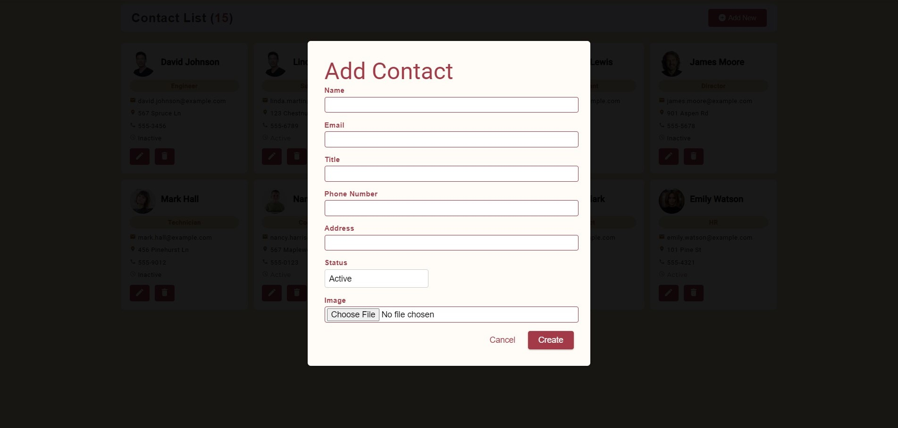
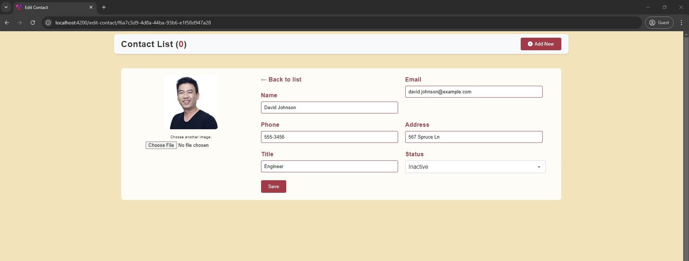
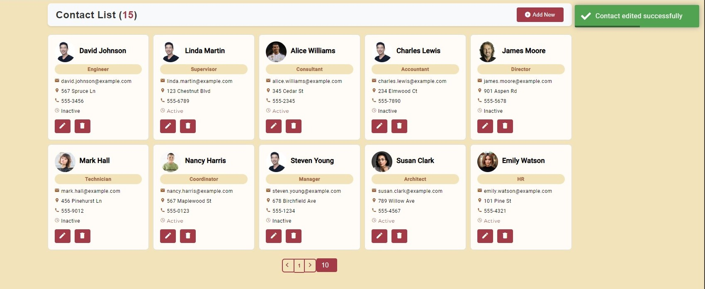
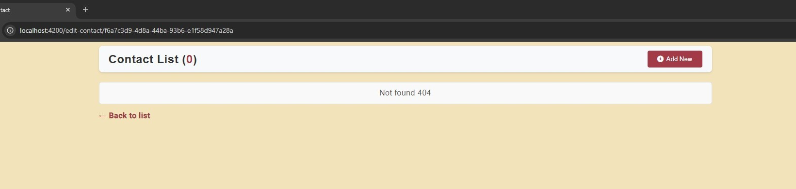
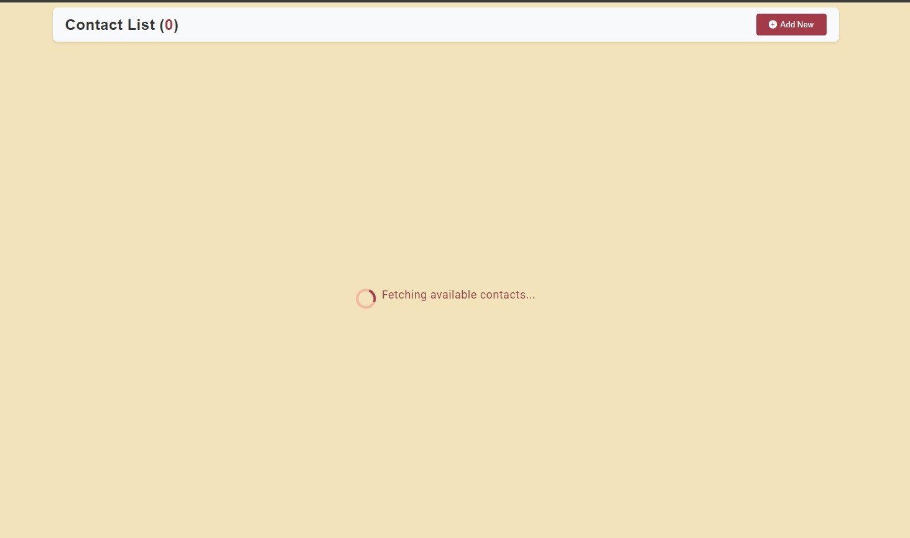
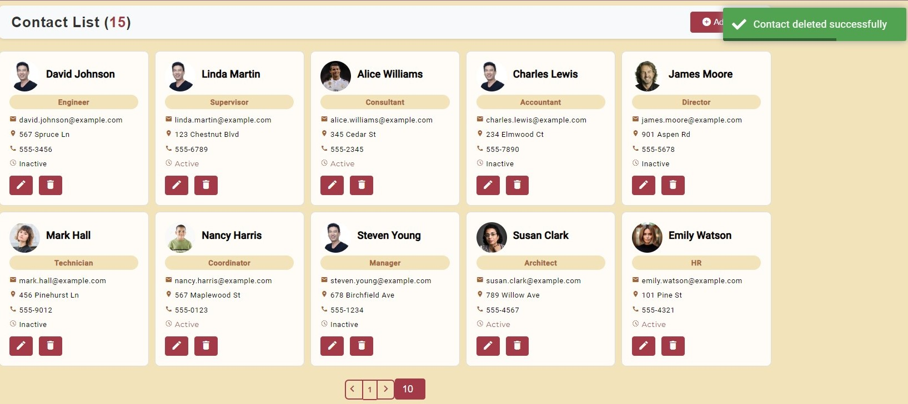
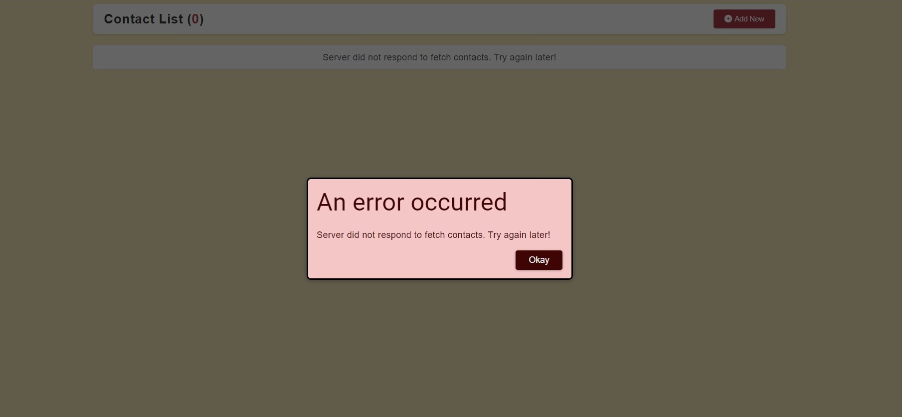

# Full Stack CRUD Application

 

A full stack CRUD application using Angular for the frontend and Spring Boot for the backend.

## Table of Contents
- [Features](#features)
- [Technology Stack](#technology-stack)
- [Getting Started](#getting-started)
- [Screenshots](#screenshots)
- [Project Structure](#project-structure)
- [Contributing](#contributing)
- [License](#license)

## Features
- **Create**: Add new contacts to the list.
- **Read**: View contacts with pagination.
- **Update**: Edit existing contacts.
- **Delete**: Remove  contacts.
- Error handling when server is down or 404.
- Loading snippet when server is fetching
- Toast nodification for http requests

## Technology Stack

| Frontend  | Backend      | Database  | Tools        |
|-----------|--------------|-----------|--------------|
| Angular   | Spring Boot  | POSTGRESQL| Postman      |
| TypeScript| Java         |           | Git          |
|           |Jpa& Hibernate|           | JetBrains    |
## Getting Started

### Prerequisites
- Node.js 
- JDK
- POSTGRESQL
- GIT

### Installation
1. **Clone the repository**:
   ```bash
   git clone https://github.com/antoniomucollari/fullstackcrud/
## Screenshots

### Add Item Form

### Edit Item Page

### After edit toast nodification

### Edit but id is not found

### Loading until fetched

### Paginator

### On delete

### Server down
<<<<<<< HEAD

=======

>>>>>>> d58fb3465189b7b71089e1af001ef11c2bd0b862
